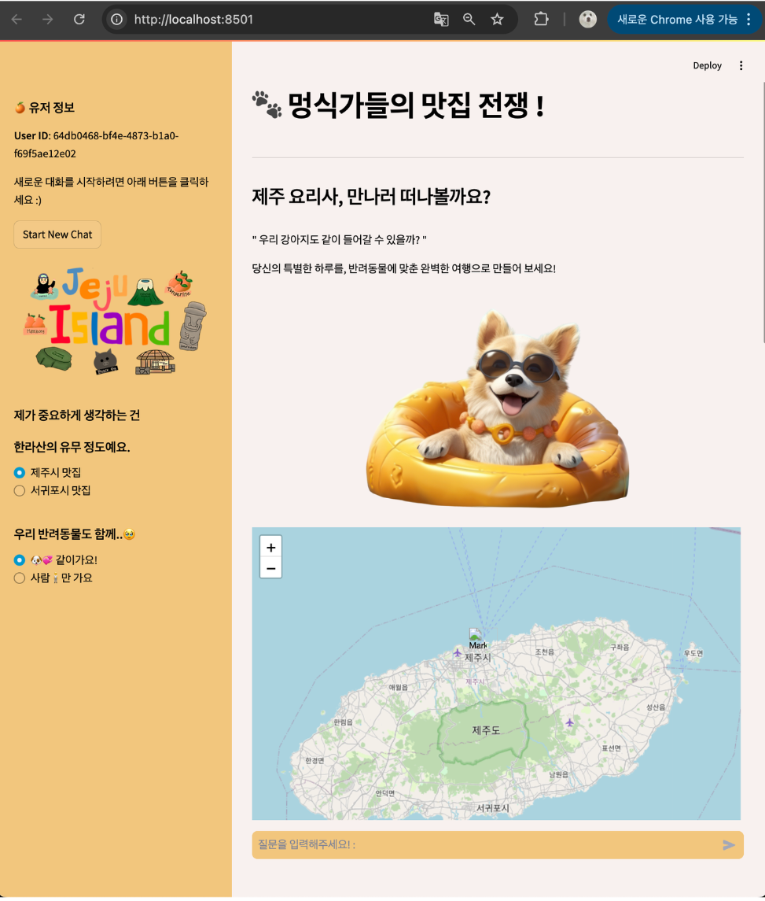

# PetJJu 🐾
### 반려동물 동반 제주여행 추천 챗봇 — 멍식가들의 맛집 전쟁!

음식점·관광지·반려동물 편의시설 정보를 검색하고, Gemini 기반 답변과 지도를 통해 여행 장소를 확인하는 RAG 웹 챗봇입니다.

**2024년 제12회 빅데이터분석경진대회(빅콘테스트) · 생성형 AI 분야 최우수상(한국지능정보사회진흥원장상)**



*프로젝트 당시 로컬 실행 화면입니다. 지역 선택·질문 입력·지도 배치를 보여주는 초기 화면이며, 추천 답변이나 검색 정확도를 입증하는 화면은 아닙니다.*

## 프로젝트 개요

반려동물과 함께 여행할 때는 음식점뿐 아니라 주변 관광지와 편의시설의 조건도 함께 확인해야 합니다. PetJJu는 서로 다른 유형의 정보를 한 서비스에서 검색하고, 사용자의 요청에 맞는 추천 답변을 제공하도록 개발한 팀 프로젝트입니다.

| 항목 | 내용 |
| --- | --- |
| 이용 방식 | 지역 선택 → 자연어 질문 → 관련 정보 검색 → 추천 답변 및 지도 확인 |
| 활용 데이터 | 음식점, 관광지, 반려동물 편의시설 |
| 주요 기술 | Python, 한국어 임베딩, Pinecone, Gemini API, Streamlit, Kakao 주소 검색 API, Folium |
| 결과물 | 검색·생성·지도 표시를 연결한 웹 챗봇 |

## 담당 역할 · 김효주

- **데이터 전처리·통합:** 팀원별로 다른 컬럼과 형식을 맞추고 검색·답변 생성에 필요한 공통 필드를 정리했습니다.
- **검색 필터링:** 사용자 표현을 메타데이터 조건으로 연결하고, 검색 결과가 없을 때의 재검색 흐름을 구성했습니다.
- **프롬프트 설계:** 검색 정보와 이전 대화 맥락을 답변에 반영하도록 구성했습니다.
- **서비스 연계:** RAG·Streamlit 구현에 참여하고 화면의 지역 선택이 검색에 반영되는지 점검했습니다.
- **협업·발표:** 팀 일정을 조율하고 최종 발표에서 기획 의도와 구현 결과를 전달했습니다.

아래 기능 설명은 팀 서비스 전체를 기준으로 하며, 개인 담당 범위는 위 항목과 같습니다.

## 주요 기능

### 1. 자연어 요청과 메타데이터 검색 결합

`upskyy/bge-m3-korean` 임베딩 기반 유사도 검색에 메타데이터 필터를 결합했습니다. 질문의 키워드와 화면에서 선택한 지역을 활용해 데이터 유형별 검색 조건을 생성합니다.

| 요청 예시 | 연결한 검색 정보 |
| --- | --- |
| 가성비 좋은 식당 | 이용금액 구간 |
| 현지인 맛집 | 현지인 이용건수 비중 |
| 한식·카페 | 음식 종류 |
| 반려견과 함께 갈 곳 | 음식점의 동반 가능 정보, 관광지의 반려동물 언급 정보 |
| 여름에 방문할 곳 | 음식점 데이터의 기준연월 |
| 대형견 관련 시설 | 반려동물 편의시설의 입장 가능 크기 |

이 규칙은 보유 데이터로 요청을 해석하기 위한 기준입니다. 낮은 이용금액이 만족도를 보장하거나, 반려동물 언급만으로 현재 입장 가능 여부가 확정되는 것은 아닙니다.

### 2. 유형별 검색과 재검색

Pinecone의 `unique`, `restaurant`, `place`, `pet` 네임스페이스를 조회하고 결과를 모읍니다. 검색 결과가 없으면 반려동물 동반 가능 필터로 재검색합니다. 이때 기존 지역·가격 등의 조건은 완화될 수 있습니다.

### 3. 검색 근거와 대화 맥락을 활용한 답변

검색 문서의 메타데이터와 이전 대화 내용을 Gemini API에 전달합니다. 프롬프트에는 다음 지침을 포함했습니다.

- 검색된 정보에 근거해 답변하기
- 이전에 추천한 장소의 반복 피하기
- 검색 결과가 한 곳이면 해당 장소만 안내하기
- 음식점과 주변 관광·편의시설 정보를 함께 안내하기

이는 모델에 전달하는 지침이며, 정보 오류나 중복 추천을 완전히 차단하는 검증 장치를 의미하지는 않습니다.

### 4. 지도 및 대화 화면

- Streamlit에서 질문과 답변을 표시하고 사용자별 대화 이력을 관리합니다.
- 새로운 대화를 시작하면 대화 기록을 초기화합니다.
- Kakao 주소 검색 API로 검색된 장소의 주소를 좌표로 변환합니다.
- Folium 지도에 장소명과 위치를 표시합니다.

## 처리 흐름

1. 사용자가 지역을 선택하고 질문합니다.
2. 질문의 키워드를 데이터 유형별 필터로 변환합니다.
3. 한국어 임베딩과 Pinecone으로 관련 문서를 검색합니다.
4. 검색 정보·질문·대화 이력을 프롬프트로 구성합니다.
5. Gemini가 추천 답변을 생성하고 Streamlit에서 표시합니다.
6. 검색된 장소의 주소를 좌표로 변환해 지도에 표시합니다.

## 결과와 검증 범위

- 데이터 검색, 답변 생성, 지도 표시를 연결한 팀 웹 챗봇을 완성했습니다.
- 최종 발표를 진행하고 빅콘테스트 생성형 AI 분야 최우수상을 수상했습니다.
- 서비스 이용률, 추천 정확도, 시간 절감 등의 운영 지표는 이 저장소에서 검증된 수치로 제시하지 않습니다.

## 저장소 구성

| 파일 | 내용 |
| --- | --- |
| `app_PetJJu.py` | 검색 조건 생성, RAG, LLM 호출, 대화·지도 화면 |
| `requirements.txt` | 프로젝트 의존성 목록 |
| `assets/petjju-home.png` | 당시 로컬 실행 화면 |

## 실행 준비

이 저장소는 대회 당시 구현 코드를 보관한 것입니다. 아래는 코드에 따른 준비 절차이며, 현재 환경에서의 재실행은 별도로 확인해야 합니다. 코드만 내려받아서는 검색 데이터가 준비되지 않습니다.

### 필요한 외부 자원

- Gemini API 키와 호출 가능한 모델
- Pinecone API 키 및 데이터가 적재된 인덱스
- 코드가 참조하는 네임스페이스와 메타데이터 필드
- Kakao 주소 검색 API 키

### 설치 및 환경 설정

```bash
git clone https://github.com/Hyoju-1/pet_jeju.git
cd pet_jeju
python -m venv .venv
# 가상환경을 활성화한 후 실행
pip install -r requirements.txt
```

프로젝트 폴더에 `.env`를 만들고 다음 환경변수를 설정합니다. 실제 키는 저장소에 올리지 않습니다.

```dotenv
PINECONE_API_KEY=your_pinecone_api_key
PINECONE_ENVIRONMENT=your_environment
INDEX_NAME=your_existing_index
GEMINI_API_KEY=your_gemini_api_key
KAKAO_API_KEY=your_kakao_api_key
```

현재 코드의 `load_dotenv(dotenv_path=...)`에는 개발자의 로컬 경로가 지정돼 있습니다. 프로젝트 폴더의 환경파일을 읽도록 해당 부분을 수정해야 합니다.

```python
from pathlib import Path
from dotenv import load_dotenv

load_dotenv(Path(__file__).resolve().parent / ".env")
```

기존 Pinecone 인덱스와 데이터를 준비한 뒤 실행합니다.

```bash
streamlit run app_PetJJu.py
```

대회 당시 모델 설정은 `gemini-1.5-flash`입니다. 재실행 시 모델 제공 여부와 라이브러리 호환성을 확인하고, 변경한다면 검색·응답 흐름을 다시 검증해야 합니다.

## 보완할 부분

- 검색 조건을 완화했을 때 사용자에게 변경된 조건 안내
- 여러 차례 질문했을 때 검색 필터의 유지·변경 처리 보완
- 반려동물 동반 UI 선택과 실제 검색 필터의 연결 점검
- 데이터 유형별 재검색 조건과 필수 메타데이터 검증
- 답변에 언급된 장소와 지도 표시 장소의 일치 여부 검증
- 조건 충족률·응답 시간·오류율을 측정하는 테스트 구성

현재 확인한 구현 범위와 향후 개선 항목을 구분해 기록했습니다.
